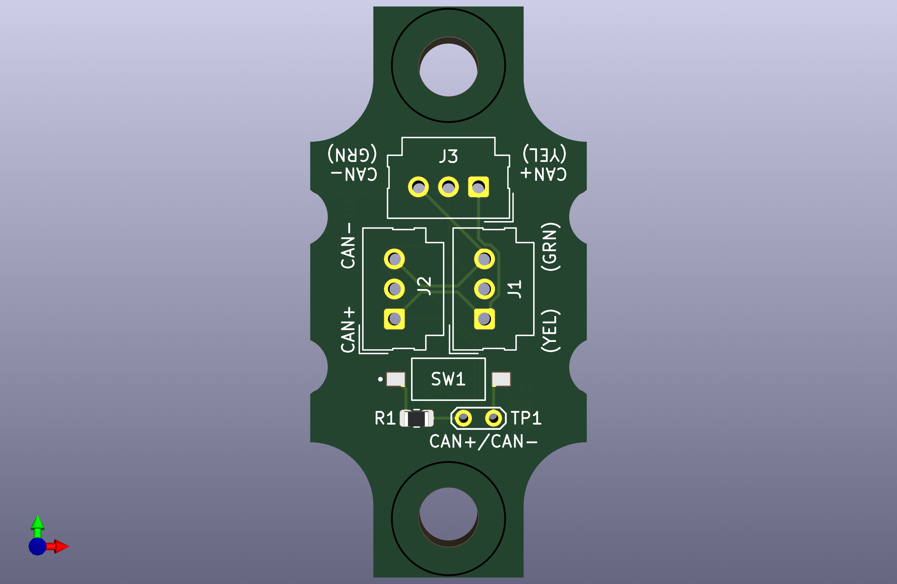

# CANTERM

A single SKU for FRC teams providing the following features:

1. Fixed mounting junction for CAN connections, compatible with the 0.1" pitch connector of your choice (Molex SL footprints on silkscreen)
2. Solder pads and test points for 22AWG wire
3. 3 connection points - create short stubs out to individual devices and have a passthrough
4. Switchable termination - every junction can be a termination point!
5. Mountable to standard 0.5"x#10 FRC pitch grid

## How to use

### Mounting

I recommend a fixed connection to a hard surface, with padding behind to prevent the through-hole pins from making electrical contact.

[Here](https://cad.onshape.com/documents/4bac7b549ef6666940699ce5/w/56cf0a0da1905853099fed6a/e/bae3fd6128463807bfcfc51d?renderMode=0&uiState=67784d31596e316774ed116e) is a WIP Case CAD that accomplishes this.

### As a junction

1. Connect your input connector to one set of contacts
2. Connect your output connector to a second set of contacts
3. Set the termination switch to `OFF` (away from `ON`)

#### Debugging

Have a break in your CAN chain but don't know where it is? Use the switchable termination feature to find out where

1. Disconnect your output connector
2. Set the termination switch to `ON`
3. You should now have a properly terminated network on the input side. If problems persist, the break is on that side. If they don't the break is on the output side.
4. Repeatedly bisect the network until the problem is found
5. Reconnect connectors and set the termination back to `OFF`

### As a terminator

1. Connect your input connector to one set of contacts
3. Set the termination switch to `ON`

### As a junction with a stub

1. Connect your input connector to one set of contacts
2. Connect your output connector to a second set of contacts
3. Connect your stub connector to the third set of contacts
3. Set the termination switch to `OFF` (away from `ON`)

### As a terminator (soldered)

1. Strip ~3/8" of each of your CAN wires.
2. Feed them through the test points
3. Solder to the contact patches on the back, making sure to also solder through the test points
4. Trim excess wire.
5. Set the termination switch to `ON`

## BOM

1. 3x `Molex_SL_171971-0003` (only 2 needed if not making stubs)
2. 1x 120 ohm 0805 SMT resistor
3. 1x SPST 0.1" pitch SMT DIP switch (DS04-254-2-01BK-SMT is what I used)
